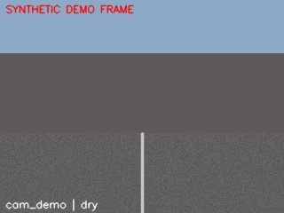
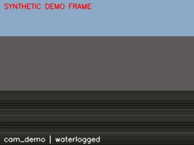
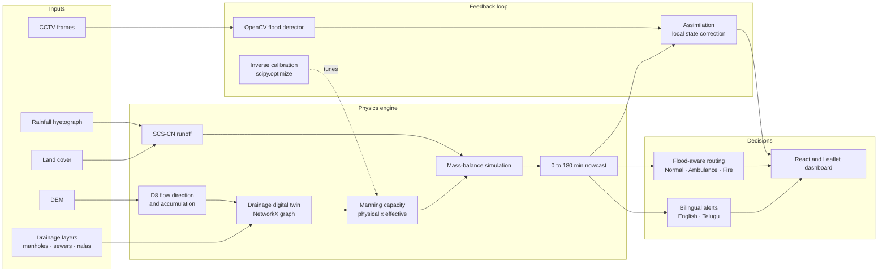

<div align="center">

# 🌊 HYDROLOOP

### Urban Flood Nowcasting by Coupling Rainfall, Drainage Physics & CCTV Vision

*See the flood coming. Verify it with cameras. Route people around it. Warn them in their own language.*

<br/>


**[Overview](#-overview) · [Novelty](#-what-makes-hydroloop-different) · [Physics Engine](#-the-physics-engine-why-we-dont-rely-on-ml-alone) · [CCTV + OpenCV](#-cctv-as-a-live-flood-sensor-opencv) · [Architecture](#-architecture) · [Quick Start](#-quick-start) · [Results](#-evaluation-results) · [Transparency](#-transparency-real-vs-synthetic) · [Roadmap](#-roadmap)**

</div>

---

## 📌 Overview

Hyderabad's **13 October 2020 floods** (192 mm GHMC-average rainfall in 24 h, a 324.5 mm station peak, and a city-wide record) showed that the problem isn't only *how much* rain falls. It's **where the drains can't keep up**, and **whether people find out in time**.

**HYDROLOOP** is a working prototype that answers that end to end. It takes rainfall and turns it into runoff, pushes that runoff through a **physics engine over a digital twin of the drainage network**, predicts flooding **0–3 hours ahead**, corrects itself using **CCTV camera observations**, and then acts on the result with **flood-aware routing** and **bilingual (English / Telugu) alerts**.

> Built for **Smart India Hackathon, Problem Statement 26085**: *Urban Flood Nowcasting System (Drainage and Rainfall Coupling)*.

### The pipeline at a glance

```
 Rainfall ─► SCS-CN Runoff ─► DEM Flow Routing ─► Drainage Digital Twin ─► Manning's Capacity
                                                                                  │
   Alerts (EN/TE) ◄─ Flood-Aware Routing ◄─ CCTV Assimilation (OpenCV) ◄─ 0–3 h Nowcast
                                                                                  ▲
                                            Inverse Calibration (scipy) ──────────┘
                                            (learns real drain capacity from past floods)
```

---

## ✨ What Makes HYDROLOOP Different

Most flood tools stop at a rainfall map or a black-box prediction. HYDROLOOP's contribution is the **coupling of independent signals into one auditable loop**.

| # | Novelty | What we did | Where |
|---|---------|-------------|-------|
| 1 | **⚙️ Physics-first engine, not black-box ML** | Floods are simulated from first principles (runoff → drainage hydraulics → water balance → DEM routing). It works on unseen extreme storms, needs almost no flood labels, conserves mass, and explains *why* a street floods. See [the physics engine](#-the-physics-engine-why-we-dont-rely-on-ml-alone). | [`hydrology/`](backend/app/hydrology) · [`drainage/`](backend/app/drainage) |
| 2 | **📹 CCTV cameras as flood sensors (OpenCV)** | Existing city cameras become low-cost water-level observers. An explainable OpenCV pipeline scores each frame for flooding, and the result is fed back into the model. **No new hardware needed.** | [`cctv/flood_detection.py`](backend/app/cctv/flood_detection.py) |
| 3 | **🔁 Data assimilation, not just detection** | A camera observation doesn't just raise a flag. It *corrects the live flood state* through a confidence-weighted, Kalman-style blend of prediction and observation. | `assimilate()` |
| 4 | **🧠 Fast state vs. slow parameters** | We deliberately separate *"what is flooded right now"* (CCTV, seconds) from *"how good are these drains really"* (calibration, per event). One camera frame **never** permanently rewrites infrastructure capacity. | `cctv/` vs `calibration/` |
| 5 | **🕳️ Physical vs. effective capacity** | Manning's equation gives what a pipe *should* carry. An **effective factor** captures silt, encroachment and undocumented connections, the real reason Indian city drains underperform. | [`drainage/capacity.py`](backend/app/drainage/capacity.py) |
| 6 | **🎯 Inverse calibration** | Given a past flood, `scipy.optimize` (Nelder–Mead) *infers* the hidden effective capacity per drain type, instead of trusting as-built drawings. | [`calibration/inverse_calibration.py`](backend/app/calibration/inverse_calibration.py) |
| 7 | **🗺️ Drainage digital twin with inferred edges** | Where the real network has gaps, DEM flow-accumulation low points are added as **INFERRED** edges with lower confidence, so unmapped water paths aren't silently ignored. | [`drainage/graph_builder.py`](backend/app/drainage/graph_builder.py) |
| 8 | **🏷️ Provenance on every feature** | Every node, edge and layer carries `source` + `confidence` (`real:*` / `inferred:dem` / `synthetic-demo`). The map renders them differently, so users always know what to trust. | [`core/schemas.py`](backend/app/core/schemas.py) |
| 9 | **🚑 Role-aware, flood-aware routing** | Separate profiles for **NORMAL**, **AMBULANCE** and **FIRE**. Emergency vehicles accept more risk to save time, but **never** route through CRITICAL flooding. | [`routing/flood_aware_routing.py`](backend/app/routing/flood_aware_routing.py) |
| 10 | **📣 Bilingual public alerts** | English and **Telugu** alert templates generated from the nowcast. Nothing is dispatched unless real provider credentials exist (safe by default). | [`alerts/alert_service.py`](backend/app/alerts/alert_service.py) |
| 11 | **🔌 Plug-and-play data adapters** | Real TGRAC / IMD / DEM adapters and synthetic generators satisfy the **same schema contracts**. Swapping in real data changes zero pipeline code. | `ingestion/` + `core/schemas.py` |

---

## 🔬 The Physics Engine: Why We Don't Rely on ML Alone

Urban floods are **dynamic, non-stationary and dominated by extremes**. A model that only learns patterns from past floods is weakest exactly when it matters most: a record storm outside its training data. HYDROLOOP's core is therefore a **physics engine that simulates how water actually moves**, and observation (CCTV) and calibration then correct it.

### Why physics-first makes the system stronger

| Strength | Why it matters for flood nowcasting |
|---|---|
| **Extrapolates to unseen extremes** | Physical laws still hold at record intensity. The 13 Oct 2020 storm broke Hyderabad's previous daily record of 241.5 mm (set in 2000), so a model trained only on history would never have seen anything like it. |
| **Needs almost no flood labels** | Verified flood-extent data is scarce (we have one event). The engine needs pipe geometry, terrain and rainfall, and calibration tunes just **4 physical parameters**. |
| **Conserves mass by construction** | Water in = water out + water stored. The test suite asserts depths are never negative or absurd. Pure ML can predict impossible values. |
| **Explains *why*** | Every result traces to a formula: which pipe was exceeded, by how much, at which node. A civic engineer can audit it. |
| **Supports "what if"** | Change a pipe diameter or clear a silted nala and capacity recomputes, so the flood map changes. ML cannot answer questions about infrastructure it never saw. |
| **Stays correctable** | Physics gives the baseline, then [inverse calibration](#-what-makes-hydroloop-different) fixes structural parameters and [CCTV assimilation](#-cctv-as-a-live-flood-sensor-opencv) fixes the live state. |

> **Honest scope:** we have **not** benchmarked against a pure-ML baseline (no labelled dataset exists to do that fairly). The argument above is about robustness, data requirements and explainability, not a measured accuracy win.

### The physics chain

The full derivation is in [`docs/mathematical_formulation.pdf`](docs/mathematical_formulation.pdf). The core equations and where they live in code:

| Stage | Equation | Code | Status |
|---|---|---|:---:|
| **Runoff** | $Q = \dfrac{(P - I_a)^2}{P - I_a + S},\; S = \dfrac{25400}{CN} - 254$ | [`hydrology/runoff.py`](backend/app/hydrology/runoff.py) | 🔄 |
| **Pipe geometry** | $A = \dfrac{\pi D^2}{4},\; R = \dfrac{D}{4}$ (full pipe) | [`drainage/capacity.py`](backend/app/drainage/capacity.py) | ✅ |
| **Pipe slope** | $S = \dfrac{z_{in} - z_{out}}{L}$ | `ingestion/synthetic_catchment.py` | ✅ |
| **Drain capacity** | $Q_{pipe} = \dfrac{1}{n} A R^{2/3} S^{1/2}$ | `drainage/capacity.py` | ✅ |
| **Effective capacity** | $Q_{eff} = \phi \cdot Q_{pipe}$, with $\phi \in (0,1]$ | `drainage/capacity.py` | ✅ ★ |
| **Excess water** | $Q_{excess} = \max(0,\, Q_{runoff} - Q_{drain})$ | [`hydrology/simulation.py`](backend/app/hydrology/simulation.py) | ✅ |
| **Water balance** | $\Delta V = V_{in} - V_{out} - V_{drain}$ | `hydrology/simulation.py` | 🔄 |
| **Ponding depth** | $h = V_{storage} / A_{pond}$ | `hydrology/simulation.py` | ✅ |
| **DEM routing** | $z_{neighbor} < z_{cell} \Rightarrow$ downhill flow (D8) | [`hydrology/dem_processing.py`](backend/app/hydrology/dem_processing.py) | ✅ |
| **Road flood risk** | worst depth near a road → risk class | [`routing/flood_aware_routing.py`](backend/app/routing/flood_aware_routing.py) | 🔄 |

✅ implemented as formulated · 🔄 implemented with a deliberate adaptation · ★ our extension

**The adaptations, and why we made them**
- **SCS-CN instead of the Rational Method for runoff.** The Rational Method ($Q = CiA$) is the simple formulation. In code we use SCS-CN because it works on *cumulative storm depth* and includes initial abstraction, so it captures how soil saturates over a long storm such as a 192 mm / 6 h event. Its single parameter (CN) still has a direct physical meaning.
- **Per-node water balance.** The balance is applied at each drainage-network node rather than every grid cell, and infiltration is handled inside the SCS-CN abstraction instead of as a separate $f \cdot A \cdot \Delta t$ term.
- **Five risk levels** (NONE → CRITICAL) rather than the three-class Safe / Caution / Flooded, with a road's risk taken from the worst nearby node.
- **Effective capacity ($\phi$).** The formulation uses the pure Manning value. We add $\phi$ to capture silt, encroachment and undocumented connections, and calibration learns it from a past flood.

### Physics first, layers of correction on top

```
  Layer 1  Physics engine        simulates water movement from first principles       ✅ implemented
  Layer 2  Inverse calibration   learns hidden drain condition from a past flood      ✅ implemented
  Layer 3  CCTV assimilation     corrects the live flood state from camera evidence   ✅ implemented
  Layer 4  ML residual model     learns what the physics still misses                 🗓️ formulated, planned
```

The planned fourth layer follows the hybrid design in the formulation. The physics model stays in charge and ML only predicts its **error**:

$$E_{error} = D_{reference} - D_{physics}, \qquad D_{final} = D_{physics} + f_{ML}(X)$$

with features $X = [R_{rain}, T_{rain}, z, S_{terrain}, C, A_{catchment}, Q_{drain}, Q_{excess}, L_{landcover}, d_{drain}]$. Because ML only predicts a correction on top of a physically valid answer, the result stays anchored to the physics (and the correction can be bounded so depth never goes negative). This layer is **formulated but not yet implemented**, since it needs labelled observed depths that the prototype does not have (see [Roadmap](#-roadmap)).

---

## 📹 CCTV as a Live Flood Sensor (OpenCV)

Cities already have thousands of traffic and surveillance cameras. HYDROLOOP turns them into a **distributed flood-sensing network** using classical computer vision with OpenCV.

### How the detector works

Each frame goes through a lightweight, fully explainable pipeline:

```
 Frame (BGR)
    │
    ├─► Crop to road region (lower 45% of frame)
    ├─► cv2.GaussianBlur (5×5)             → suppress noise
    ├─► cv2.cvtColor → GRAY and HSV        → brightness & saturation
    ├─► cv2.Sobel (x and y)                → horizontal vs. vertical edge energy
    │
    └─► Three physically-motivated cues:
          • Darkness      → water surfaces are darker than dry asphalt
          • Low saturation→ muddy, grey-brown floodwater
          • Horizontal banding → reflections & ripples create strong horizontal edges,
                                 while dry road texture is isotropic

    flood_score = 0.40·darkness + 0.25·low_saturation + 0.35·horizontal_banding
    flood_detected = flood_score ≥ 0.5
```

The output is a structured `FloodObservation` (camera ID, lat/lon, timestamp, `flood_detected`, `estimated_depth_m`, `confidence`), which is exactly what the assimilation step consumes.

### From pixels back into the physics

```python
corrected_depth = w · observed_depth + (1 − w) · predicted_depth      # w = detector confidence
```

The camera is matched to its **nearest drainage node**, and the model's depth at that node is nudged toward what the camera sees, weighted by how sure the detector is. If nothing is detected, the prediction is left untouched. The correction is a **local state update**, never a permanent capacity change.

### Demo frames

Three procedurally generated frames ship in [`data/demo/cctv_frames/`](data/demo/cctv_frames). Each is stamped `SYNTHETIC DEMO FRAME` so no one mistakes them for real footage.

| Dry road | Waterlogged | Waterlogged (severe) |
|:---:|:---:|:---:|
|  |  |  |
| ✅ Not flagged | 🚨 Flood detected | 🚨 Flood detected |

> **Swap-ready by design:** the interface `detect_flood(frame) → FloodObservation` is deliberately model-agnostic. A fine-tuned segmentation network can replace the heuristic without touching a single line of assimilation code.

---

## 🧱 Architecture



### Nowcast product

For every node in the drainage network, HYDROLOOP produces depth and risk at **T+0 / 15 / 30 / 60 / 120 / 180 minutes**, plus expected flood-onset time and a horizon-decaying confidence.

| Risk level | Depth threshold |
|:---:|:---:|
| 🟢 LOW | ≥ 0.05 m |
| 🟡 MODERATE | ≥ 0.15 m |
| 🟠 HIGH | ≥ 0.30 m |
| 🔴 CRITICAL | ≥ 0.50 m |

*Thresholds are configurable and flagged `validated: false` in every API response.*

### Flood-aware routing

Road edges near at-risk nodes are penalized by risk level. The risk tolerance differs by who is driving:

| Profile | Risk tolerance | Behavior |
|---|:---:|---|
| `NORMAL` | 1.0× | Full risk penalty on flooded roads (LOW 1.3×, MODERATE 2.5×, HIGH 8×) |
| `AMBULANCE` | 0.6× | Penalty scaled down, so it accepts more risk to save time |
| `FIRE` | 0.5× | Lowest penalty, most willing to trade risk for speed |
| *any profile* | — | **CRITICAL edges are treated as impassable** |

---

## 🧰 Tech Stack

| Layer | Technologies |
|---|---|
| **Vision** | OpenCV (`opencv-python-headless`) |
| **Backend** | Python 3.11 · FastAPI · Uvicorn · Pydantic |
| **Hydrology & Geospatial** | NumPy · SciPy · NetworkX · GeoPandas · Shapely · Rasterio · PyProj |
| **Frontend** | React 18 · TypeScript · Vite · Leaflet / react-leaflet |
| **Deployment** | Docker · Docker Compose · Nginx · optional PostGIS profile |
| **Testing** | pytest (14 tests) |

---

## 🚀 Quick Start

### Option A: Docker Compose (recommended)

```bash
git clone <your-repo-url>
cd <your-repo-folder>
docker compose up --build
```

| Service | URL |
|---|---|
| Dashboard | http://localhost:5173 |
| API | http://localhost:8000 |
| Interactive API docs | http://localhost:8000/docs |

### Option B: Run locally

```bash
# Backend
cd backend
python3 -m venv .venv && source .venv/bin/activate
pip install -r requirements.txt
uvicorn app.main:app --reload --port 8000

# Frontend (new terminal)
cd frontend
npm install
npm run dev          # http://localhost:5173  (proxies /api → :8000)
```

> **Note:** on some systems GeoPandas/Rasterio may need GDAL system libraries when installed locally. The Docker route handles this for you.

---

## 🎬 Running the Demo

Open the dashboard and use the two demo modes in the left panel.

**▶ Run Flood Scenario** runs a synthetic 150 mm / 4 h storm through the full pipeline:
1. Rainfall → runoff → drainage simulation → 0–3 h nowcast on the map
2. OpenCV analyses the three camera frames and assimilates positive detections
3. The worst-hit node triggers a bilingual mock alert
4. Click two map points to get a normal vs. flood-aware route (pick a profile first)
5. Drag the **timeline slider** to scrub from NOW to T+180 min

**⟲ Historical Event Replay (13 Oct 2020)** replays the 192 mm / 6 h profile, runs inverse calibration, and shows before/after metrics plus a second-storm transfer check.

### Or use the API directly

```bash
curl http://localhost:8000/api/scenario/run
curl http://localhost:8000/api/scenario/historical-replay
```

| Method | Endpoint | Purpose |
|:---:|---|---|
| `GET` | `/api/catchment/layers` | All GIS layers, each tagged with source and confidence |
| `GET` | `/api/catchment/dem` | DEM, flow accumulation and detected low points |
| `GET` | `/api/scenario/run` | Storm scenario: nowcast, CCTV observations, assimilation |
| `GET` | `/api/scenario/historical-replay` | Calibration, before/after metrics, holdout check |
| `POST` | `/api/routing/route` | Normal vs. flood-aware route for a chosen profile |
| `POST` | `/api/alerts/dispatch` | Generate EN + TE alert content (mock unless credentials set) |
| `GET` | `/api/health` | Health check |

### Run the tests and experiments

```bash
cd backend
python3 -m pytest ../tests -v            # 14 tests
python3 ../scripts/run_experiments.py    # regenerates docs/experiment_results.*
```

---

## 📊 Evaluation Results

We ran a progressive **A → D experiment ladder** against the 13 Oct 2020 rainfall profile, adding one capability at a time.

| Experiment | Precision | Recall | F1 |
|---|:---:|:---:|:---:|
| **A.** Rainfall only (uniform depth) | 0.146 | 1.000 | 0.255 |
| **B.** + DEM (infinite drainage capacity) | 0.158 | 0.500 | 0.240 |
| **C.** + Drainage network (capacity-constrained) | 0.160 | 1.000 | 0.276 |
| **D.** + Inverse calibration | 0.160 | 1.000 | 0.276 |

> ⚠️ **Read this honestly.** Ground truth here is **synthetic** (12 of 82 nodes flagged as flooded), so these numbers show that *the pipeline mechanism works end to end*, **not** real-world forecast skill.

**What the ladder teaches us**
- **A → B:** spatial routing alone *hurts* recall. Without a capacity limit, water never backs up where it truly would. This is why the drainage network matters, not just topography.
- **B → C:** adding capacity constraints pulls predictions back toward genuinely under-drained nodes.
- **C → D:** calibration *does* move the capacity factors (e.g., open-channel efficiency shifts from its 0.55 prior to ~0.33), but at a record 192 mm storm most of the catchment exceeds capacity regardless, so classification is correctly insensitive. At moderate rainfall, calibration visibly improves F1 (0.269 → 0.312 in development testing).
- **E. CCTV assimilation** is reported separately, since it is a local correction at camera-adjacent nodes rather than a graph-wide re-run.

Full details: [`docs/experiment_results.md`](docs/experiment_results.md) · raw data: [`docs/experiment_results.json`](docs/experiment_results.json)

---

## 🔍 Transparency: Real vs. Synthetic

We hold ourselves to one rule: **nothing is labeled "real" unless it was actually fetched from a real source.** The build environment could not reach the TGRAC / IMD servers, so the running demo uses **schema-matched synthetic data placed on real Hyderabad geography**.

| | Status |
|---|---|
| ✅ **Real** | Hyderabad location & terrain gradient · 13 Oct 2020 event date and rainfall totals · every engineering formula (SCS-CN, Manning's, D8) · TGRAC/IMD adapter code paths |
| 🧪 **Synthetic** *(tagged `source="synthetic-demo"`)* | Drainage network · roads · DEM · land cover · flooded-area ground truth · CCTV frames |
| 🔮 **Inferred** *(tagged `inferred:dem`)* | Extra flow paths added at DEM low points, at reduced confidence |

Every layer in the API and on the map is tagged with its provenance, and the dashboard renders synthetic and inferred features distinctly.

**Known simplifications** *(full list in [`docs/limitations.md`](docs/limitations.md))*
- Mass-balance routing instead of full St. Venant hydraulics (auditable, but not survey-grade)
- Runoff assigned to the nearest drainage node rather than routed cell-by-cell
- Ponding depth uses an assumed area fraction, so treat depths as relative-risk indicators
- Free-draining outlets (no Musi River backwater modeled)
- The CCTV detector is a hand-built heuristic, validated only on synthetic frames, and its depth is a coarse proxy
- Only one historical event is available, so true multi-event validation is still pending

📄 Data provenance table: [`data_inventory.md`](data_inventory.md) · 📄 Event sourcing: [`docs/historical_event_13oct2020.md`](docs/historical_event_13oct2020.md)

---

## 🗂️ Repository Structure

```
├── backend/
│   └── app/
│       ├── core/          # Shared schemas & data contracts (real vs. synthetic tagging)
│       ├── ingestion/     # Real TGRAC client + synthetic data generators
│       ├── hydrology/     # DEM processing, SCS-CN runoff, simulation, nowcast
│       ├── drainage/      # Graph builder + Manning's capacity model
│       ├── calibration/   # Inverse calibration (scipy) + event validation
│       ├── cctv/          # OpenCV flood detector, assimilation, demo frames
│       ├── routing/       # Flood-aware routing (Normal / Ambulance / Fire)
│       ├── alerts/        # Bilingual EN/TE alert service (mock-safe)
│       ├── demo/          # Orchestrator behind the two demo modes
│       └── api/           # FastAPI routes
├── frontend/src/          # React + TypeScript + Leaflet dashboard
├── data/demo/             # Synthetic CCTV frames
├── scripts/               # Real-data fetch helpers, experiment runner
├── tests/                 # pytest suite (14 tests)
├── docs/                  # Math formulation, limitations, experiment results, event sourcing
├── data_inventory.md      # Full data provenance table
└── docker-compose.yml
```

---

## 🧭 Roadmap

**Near term: make it real**
1. Run `scripts/fetch_real_data.sh` on a networked machine to pull real TGRAC layers, IMD rainfall and a real DEM (verify field names first with `scripts/probe_tgrac_layers.py`)
2. Source 2–3 independently verified historical flood events for genuine holdout validation
3. Replace nearest-node runoff assignment with full DEM flow-path routing

**Hybrid physics + ML**
- Train the **residual ML corrector** ($D_{final} = D_{physics} + f_{ML}(X)$) once observed flood depths are available, and report MAE / RMSE / R² against them
- Add automated **infrastructure-upgrade comparison** (reduction in peak depth, flooded area and flooded road length)

**Vision upgrade**
4. Replace the OpenCV heuristic with a **trained segmentation model** on labeled flood-CCTV footage
5. Add a **reference-object depth estimate** (e.g., kerb, pole, or gauge in frame) so camera depth becomes a measurement rather than a proxy
6. Wire in real GHMC / traffic-police camera feeds

**Scale up**
7. Move the in-memory catchment to **PostGIS** (service already defined behind `docker compose --profile with-db up`)
8. Tile the DEM and parallelize per-catchment simulation for city-wide coverage
9. Swap the mass-balance core for **EPA SWMM** once real network data justifies it
10. Validate risk thresholds and routing policy with GHMC / HMWSSB / disaster-management experts; integrate SMS/IVR providers and Cell Broadcast

---

## 👥 Team
**Team:** PrismX# · 

---

<div align="center">

*Built with a simple belief: a flood warning is only useful if it's **accurate**, **explainable**, and **reaches people in time**.*

</div>
